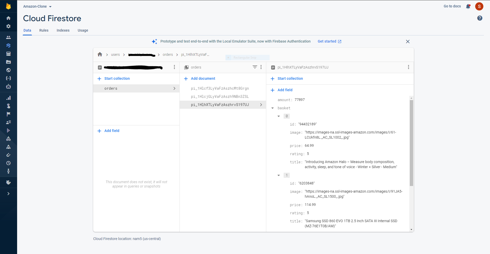
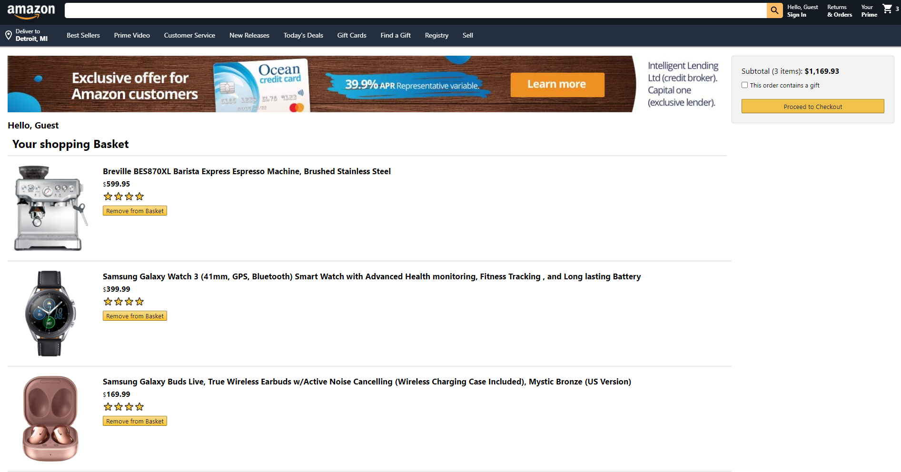
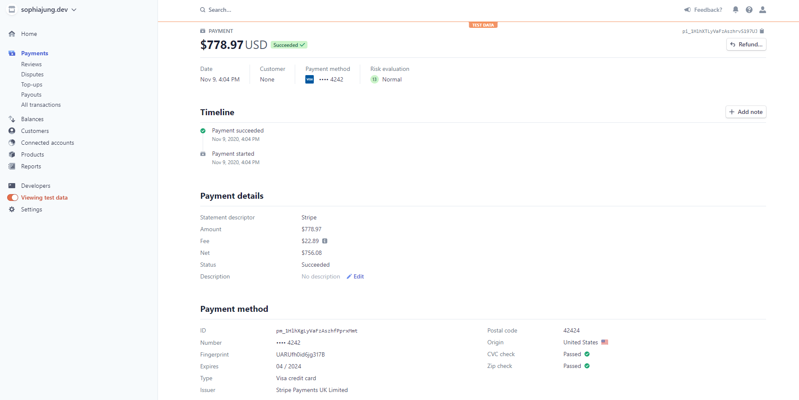

# AmazonClone

### Backend built with Firebase

### Authentication with Firebase

### Cart

### Stripe Payment API
- stripe payment process 

## Languages & Frameworks
- Firebase
- React
- JavaScript
- Material-UI
- CSS 
- HTML

## Dependencies
- firebase
- firebase-tools
- material-ui/core
- material-ui/icons
- react-currency-format

